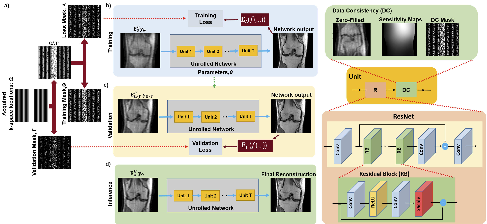

# ZS-SSL: Zero-Shot Self-Supervised Learning
ZS-SSL enables physics-guided deep learning MRI reconstruction using only a single slice/sample ([paper](https://openreview.net/forum?id=085y6YPaYjP)).
Succintly, ZS-SSL  partitions the available measurements from a single scan into three disjoint sets. Two of these sets are used to enforce data consistency and define loss during training for self-supervision, while the last set serves to self-validate, establishing an early stopping criterion. In the presence of models pre-trained on a database with different image characteristics, ZS-SSL can be combined with transfer learning (TL) for faster convergence time and reduced computational complexity.

 <br>

*An overview of the proposed zero-shot self-supervised learning approach. a) Acquired
measurements for the single scan are partitioned into three sets: a training (Θ) and loss mask (Λ) for
self-supervision, and a self-validation mask for automated early stopping (Γ). b) The parameters,
θ, of the unrolled MRI reconstruction network are updated using Θ and Λ in the data consistency
(DC) units of the unrolled network and for defining loss, respectively. c) Concurrently, a k-space
validation procedure is used to establish the stopping criterion by using Ω\Γ in the DC units and Γ
to measure a validation loss. d) Once the network training has been stopped due to an increasing
trend in the k-space validation loss, the final reconstruction is performed using the relevant learned
network parameters and all the acquired measurements in the DC unit.*


## Installation
Dependencies are given in environment.yml. A new conda environment `zs_ssl` can be installed with
```
conda env create -f environment.yml
```
## Datasets
We have used the [fastMRI](https://fastmri.med.nyu.edu/) dataset in our experiments.

## How to use
ZS-SSL training can be performed by running `zs_ssl_train.py` file. Prior to running training file, hyperparameters such as number of unrolled blocks, split ratio for validation,training and loss masks can be adjusted from `parser_ops.py`.

`zs_ssl_train.py`  file saves the model corresponding to lowest validation error and saves it to the directory defined by user. Testing can be performed by running `zs_ssl_test.ipynb` file. 

We highly recommend the users to set the outer k-space regions with no signal as 1 in training mask to ensure consistency with acquired measurements. This should be done for both `zs_ssl_train.py` and `zs_ssl_test.ipynb` files. Please refer to our [SSDU](https://github.com/byaman14/SSDU) repository for further details.

#### Transfer Learning (TL)
If ZS-SSL will be combined with TL, user should enable TL option and provide TL path to `parser_ops.py`. Note that, for transfer learning, pretrained model and ZS-SSL should have the same network architecture. We have provided a pretrained supervised model compatible with ZS-SSL architecture in `pretrained_models` folder. The pretrained model is used in `zs_ssl_train.py` for initializing the weights for the training.  Pretrained self-supervised models can also be used with ZS-SSL.   

#### Early Automated Stopping
In `parser_ops.py`, we have also defined a parameter (`--stop_training`) to automatically stop the training process. The `--stop_training` parameter denotes the number of consecutive epochs without achieving a lower validation loss (to disable early automated stopping, fix `--stop_training` to  the number of epochs). 

## Citation
If you find the paper useful in your research, please cite
```
@inproceedings{
yaman2022zeroshot,
title={Zero-Shot Self-Supervised Learning for {MRI} Reconstruction},
author={Burhaneddin Yaman and Seyed Amir Hossein Hosseini and Mehmet Akcakaya},
booktitle={International Conference on Learning Representations},
year={2022},
url={https://openreview.net/forum?id=085y6YPaYjP}
}
```

## Copyright & License Notice
© 2021 Regents of the University of Minnesota

ZS-SSL is copyrighted by Regents of the University of Minnesota and covered by US 17/075,411. Regents of the University of Minnesota will license the use of ZS-SSL solely for educational and research purposes by non-profit institutions and US government agencies only. For other proposed uses, contact umotc@umn.edu. The software may not be sold or redistributed without prior approval. One may make copies of the software for their use provided that the copies, are not sold or distributed, are used under the same terms and conditions. As unestablished research software, this code is provided on an "as is'' basis without warranty of any kind, either expressed or implied. The downloading, or executing any part of this software constitutes an implicit agreement to these terms. These terms and conditions are subject to change at any time without prior notice.

## Questions
If you have questions or issues, please open an issue or reach out to me at yaman013 at umn.edu .
